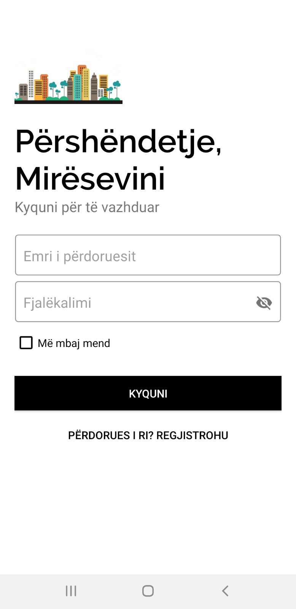

# MerrMeQera

* Android Studio IDE
* Android SDK
* Built Using Java
* Firebase Database
* Firebase - Regjistrimi dhe Kyqja në aplikacion 
* JSON - Popullimi i të dhënave të aplikacionit
* SQLite
* Komunikimi me pjese harduerike - Kamera
* Google Map Cluster 

# About
MerrMeQira është një aplikacion i dedikuar për qira të patundshmërive ekzkluzivisht në Prishtinë.
Përmes këtij aplikacioni synojmë të lehtesojme kërkimin dhe komunikimin në mes të qirradhënësit dhe qirramarrësit potencial. 
Qirradhenesit do të kenë një platforme në të cilin mund të paraqesin pronat e tyre dhe specifikat e tjera, ndërsa qirramarrësit do të
kenë mundësine të kërkojnë dhe të vendosin për cilëndo pronë që u përshtatet.

# Screenshots

 
 
