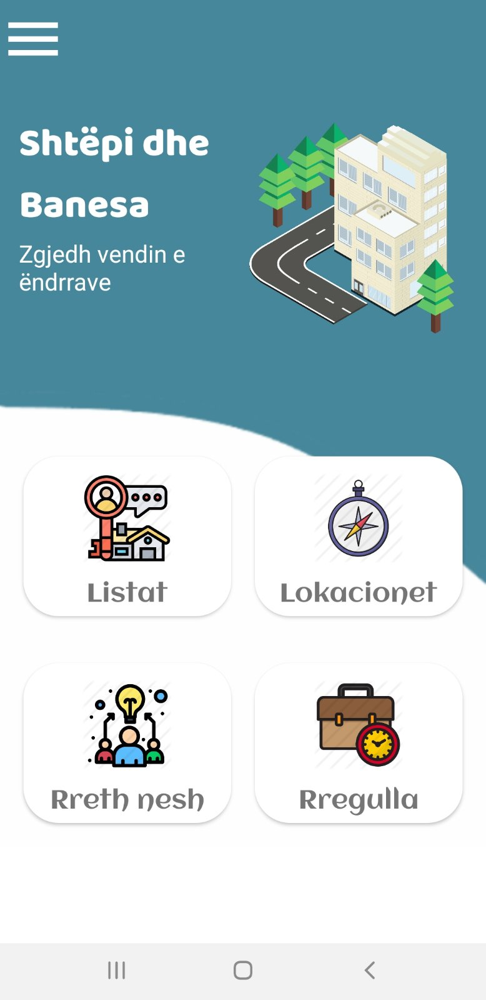

# MerrMeQera

* Android Studio IDE
* Android SDK
* Built Using Java
* Firebase Database
* Firebase - Regjistrimi dhe Kyqja në aplikacion 
* JSON - Popullimi i të dhënave të aplikacionit
* SQLite
* Komunikimi me pjese harduerike - Kamera
* Google Map Cluster 

# Përshkrimi 
MerrMeQira është një aplikacion i dedikuar për qira të patundshmërive ekzkluzivisht në Prishtinë.
Përmes këtij aplikacioni synojmë të lehtesojme kërkimin dhe komunikimin në mes të qirradhënësit dhe qirramarrësit potencial. 
Qirradhenesit do të kenë një platforme në të cilin mund të paraqesin pronat e tyre dhe specifikat e tjera, ndërsa qirramarrësit do të
kenë mundësine të kërkojnë dhe të vendosin për cilëndo pronë që u përshtatet.

# Implementimi
Kyqja dhe Regjistrimi në projekt bëhet përmes firebase databazës duke përdorur shërbimin e autentifikimit dhe real time database.Tek aktivitetet përfshihen Kyqja, Regjistrimi,Faqja Kryesore,RrethNesh,Feedback,Rregulla dhe tek këto aktivitete kemi qasje nga Faqja Kryesore dhe nga menu-ja.Komunikimi me pjesë harduerike bëhet te menu-ja, ku përdoruesi ka mundësi përmes kamerës të bëj upload një foto ne profilin e tij.
Popullimi i të dhënave të aplikacioni bëhet duke bërë request përmes Volley në serverin që kemi krijuar dhe response-i është një JsonObject.
SQLite është përdorur për të ruajtur shtëpite/banesat e preferuara të përdoruesit.
Poashtu kemi implementuar dhe hartën me cluster ku të dhënat (lat,lng) për secilen banesë/shtëpi merren nga serveri.

# Screenshots
&nbsp;  
&nbsp; 
&nbsp;&nbsp;&nbsp;&nbsp; 
&nbsp;&nbsp;&nbsp;

 
 
